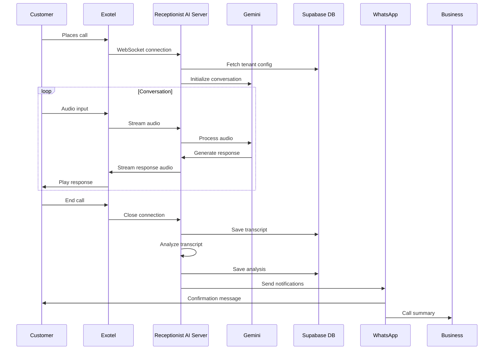

# Receptionist AI - Multi-Tenant Virtual Receptionist Platform

## Overview

Receptionist AI is an advanced, multi-tenant virtual receptionist platform that leverages Google's Gemini AI to handle customer calls for various business types (e.g., bakery, salon, etc.). The system provides real-time voice interaction, call transcript analysis, and automated post-call actions including WhatsApp notifications.


## Key Features

- **Multi-Tenant Architecture**: Single server supporting multiple business types with tenant-specific prompts and configurations
- **Real-Time Voice Interaction**: WebSocket bridge connecting Exotel telephony with Google Gemini Live API
- **Call Transcript Analysis**: AI-powered analysis of call transcripts to extract key information
- **Automated Notifications**: WhatsApp notifications to business owners and customers after calls
- **Flexible Prompt Management**: Tenant-specific prompts stored in a structured repository
- **Centralized Configuration**: Business-specific settings stored in Supabase database

## System Architecture

### Core Components

1. **WebSocket Server (`new_exotel_bridge.py`)**: 
   - Handles real-time audio streaming between Exotel and Gemini
   - Manages tenant-specific configurations and prompts
   - Saves call transcripts for analysis

2. **Transcript Analyzer (`transcript_analyzer.py`)**: 
   - Analyzes call transcripts using Gemini AI
   - Extracts call type, summary, and key details
   - Uses tenant-specific call type schemas from Supabase

3. **Action Service (`action_service.py`)**: 
   - Processes post-call actions based on call analysis
   - Manages notification workflows for different call types
   - Integrates with external services (WhatsApp via MSG91)

4. **WhatsApp Notification Service (`whatsapp_notification_service.py`)**: 
   - Generates AI-powered notification messages
   - Manages WhatsApp templates for different call types
   - Sends notifications to both customers and business owners

5. **Supabase Client (`supabase_client.py`)**: 
   - Provides database connectivity for configuration and data storage
   - Manages tenant configurations and call details

### Data Flow



## Multi-Tenant Architecture

The system uses a single-server multi-tenant approach where tenant-specific configurations are stored in:

1. **Tenant Repository**: `/tenant_repository/{tenant_id}/`
   - `prompts/assistant.txt`: Main conversation prompt
   - `prompts/analyzer.txt`: Transcript analysis prompt
   - `input_files/`: Business-specific documents (menus, service lists, etc.)

2. **Supabase Database**:
   - `tenant_configs` table: Stores tenant-specific configurations
   - `call_type_schema`: JSON schema defining valid call types for each tenant

## Setup and Configuration

### Environment Variables

```bash
# Required
GEMINI_API_KEY=your_gemini_api_key
SUPABASE_URL=your_supabase_url
SUPABASE_API_KEY=your_supabase_api_key
MSG91_AUTH_KEY=your_msg91_auth_key

# Optional
MSG91_INTEGRATED_NUMBER=your_whatsapp_number
OWNER_PHONE=business_owner_phone_number
```

### Dependencies

Install the required Python packages:
```bash
pip install -r requirements.txt
```

### Gemini Model Configuration

The system uses the following Gemini models:
- `gemini-2.5-flash-preview-native-audio-dialog`: For real-time voice conversations
- `gemini-2.5-flash`: For transcript analysis and notification message generation

## Deployment

### Local Development

To start the WebSocket bridge server locally:
```bash
python3 new_exotel_bridge.py
```

The server will start on port 8765 by default.

### Railway Deployment

This project is configured for deployment on Railway:

1. **Create a Railway account** at [railway.app](https://railway.app)
2. **Set environment variables** in the Railway dashboard
3. **Deploy the application** using the Railway CLI or GitHub integration
4. **Configure Exotel** to connect to your Railway deployment URL

## Testing

### Test Scripts

The `/test_scripts/` directory contains various tools for testing:

- `test_transcript_analyzer.py`: Tests the transcript analysis functionality
- `exotel_simulator_client.py`: Simulates Exotel client for local testing
- `local_test_client.py`: Simple test client for local development

### Running Tests

```bash
# Test transcript analyzer
python3 test_scripts/test_transcript_analyzer.py

# Run local test client
python3 local_test_client.py
```

## Database Schema

### Main Tables

1. **tenant_configs**:
   - `tenant_id`: Unique identifier for the tenant
   - `tenant_name`: Display name for the tenant
   - `call_type_schema`: JSON schema defining valid call types
   - `is_active`: Boolean flag for tenant status

2. **call_details**:
   - `session_id`: Unique session identifier
   - `call_sid`: Exotel call SID
   - `tenant`: Tenant identifier
   - `transcript`: Full call transcript
   - `call_type`: Extracted call type
   - `critical_call_details`: Extracted call details

3. **notifications**:
   - `id`: Unique identifier
   - `call_sid`: Related call SID
   - `recipient`: Notification recipient
   - `recipient_type`: Type of recipient (customer/owner)
   - `status`: Delivery status
   - `payload`: Full notification payload
   - `details`: Additional metadata

## Contributing

### Adding a New Tenant

1. Create a new tenant directory: `/tenant_repository/{tenant_id}/`
2. Add required prompt files:
   - `/tenant_repository/{tenant_id}/prompts/assistant.txt`
   - `/tenant_repository/{tenant_id}/prompts/analyzer.txt`
3. Add tenant configuration to Supabase `tenant_configs` table
4. Add any business-specific documents to `/tenant_repository/{tenant_id}/input_files/`

### Modifying Prompts

Tenant-specific prompts are stored in the tenant repository. Edit the appropriate files to modify the behavior for a specific tenant.
