# Receptionist AI - Enterprise Multi-Tenant Voice AI Platform

## 🚀 Executive Summary

**Receptionist AI** is a production-ready, enterprise-grade virtual receptionist platform that transforms customer service through AI-powered voice interactions. Built on Google's cutting-edge Gemini Live API, our system delivers human-like conversations across multiple business verticals while providing comprehensive analytics and automated follow-up workflows.

### 🎯 Value Proposition
- **24/7 Availability**: Never miss a customer call again
- **Multi-Language Support**: Native support for Telugu, Hindi, English with cultural sensitivity
- **Instant Scalability**: Single platform serving unlimited business types and locations
- **Complete Automation**: From call handling to customer notifications and business analytics
- **Enterprise Security**: Production-grade infrastructure with comprehensive logging and monitoring

## 🏗️ System Architecture

### Core Technology Stack

**🧠 AI Engine**
- **Google Gemini 2.5 Flash**: Latest multimodal AI for natural voice conversations
- **Real-time Audio Processing**: Sub-100ms response times for natural dialogue flow
- **Advanced NLP**: Structured data extraction from unstructured conversations

**🌐 Infrastructure**
- **WebSocket Server** (`new_exotel_bridge.py`): High-performance real-time audio streaming
- **Multi-Tenant Architecture**: Single codebase serving multiple business types
- **Railway Cloud Deployment**: Auto-scaling production infrastructure
- **Supabase Database**: Real-time data synchronization and analytics

**📞 Telephony Integration**
- **Exotel API**: Enterprise-grade telephony with call routing and recording
- **Audio Processing**: Real-time format conversion and quality optimization
- **Call Analytics**: Comprehensive call metrics and performance tracking

**📱 Communication Channels**
- **WhatsApp Business API**: Automated customer and business notifications
- **MSG91 Integration**: Multi-channel message delivery with templates
- **Smart Routing**: Context-aware message personalization

### 🔧 Core Components

1. **ExotelGeminiBridge** - Main orchestration server
   - Manages WebSocket connections from Exotel
   - Routes calls to appropriate tenant configurations
   - Handles real-time audio streaming and processing

2. **GeminiSession** - Individual call management
   - Tenant-specific prompt loading and greeting extraction
   - Real-time conversation management with Gemini Live API
   - Audio buffer optimization and quality control

3. **TranscriptManager** - Conversation intelligence
   - Real-time transcript capture and storage
   - Conversation token tracking for cost optimization
   - Integration with analysis pipeline

4. **ActionService** - Post-call automation
   - AI-powered call analysis and categorization
   - Automated customer and business notifications
   - Integration with external business systems

5. **AI Token Tracker** - Cost optimization
   - Real-time token usage monitoring
   - Per-call cost analysis and reporting
   - Budget management and alerts

## 🔄 Real-Time Data Flow

```mermaid
sequenceDiagram
    participant Customer
    participant Exotel as Exotel Telephony
    participant Bridge as ExotelGeminiBridge
    participant Session as GeminiSession
    participant Gemini as Google Gemini Live
    participant DB as Supabase Database
    participant Analyzer as TranscriptAnalyzer
    participant Action as ActionService
    participant WhatsApp as MSG91/WhatsApp

    Customer->>+Exotel: Initiates call
    Exotel->>+Bridge: WebSocket connection with tenant info
    Bridge->>+Session: Create GeminiSession(tenant)
    Session->>DB: Load tenant prompt & config
    Session->>+Gemini: Initialize with tenant-specific prompt
    
    Note over Session,Gemini: Dynamic greeting extraction from prompt
    Session->>Session: extract_greeting_from_prompt()
    Session->>Gemini: Send initial greeting as first message
    Gemini->>Session: AI greeting response
    Session->>Exotel: Stream greeting audio
    Exotel->>Customer: Play AI greeting
    
    loop Real-time Conversation
        Customer->>Exotel: Speaks (audio input)
        Exotel->>Session: Stream audio chunks
        Session->>Gemini: Process audio with Live API
        Gemini->>Session: Generate response (audio + transcript)
        Session->>Session: Buffer & optimize audio
        Session->>Exotel: Stream response audio
        Exotel->>Customer: Play AI response
        Session->>Session: Add to transcript (user/assistant)
    end
    
    Customer->>Exotel: Ends call
    Exotel->>Session: Connection closed
    Session->>DB: Save complete transcript
    Session->>+Analyzer: Trigger transcript analysis
    Analyzer->>DB: Fetch tenant call type schema
    Analyzer->>Gemini: Analyze with structured output
    Analyzer->>DB: Save analysis results
    Analyzer->>+Action: Trigger post-call actions
    Action->>DB: Fetch call details & tenant config
    Action->>WhatsApp: Send customer notification
    Action->>WhatsApp: Send business owner summary
    WhatsApp->>Customer: Confirmation message
    WhatsApp->>Business: Call analytics & summary
```



## 🏢 Multi-Tenant Architecture

### Tenant Isolation & Configuration

**File-Based Prompt System**
```
tenant_repository/
├── bakery/
│   ├── prompts/
│   │   ├── assistant.txt     # Main conversation prompt
│   │   └── analyzer.txt      # Analysis prompt
│   └── input_files/          # Business documents
├── sreedevi_dental_rjy/
│   ├── prompts/
│   │   ├── assistant.txt     # Telugu-first medical prompt
│   │   └── analyzer.txt      # Medical analysis
│   └── input_files/
└── [other_tenants]/
```

**Database Configuration**
- `tenant_configs`: Business-specific settings, schemas, contact info
- `call_details`: Per-call transcripts and analysis results
- `notifications`: Message delivery tracking and status
- `ai_token_usage`: Cost tracking and optimization data

## ⚙️ Production Setup & Configuration

### 🔐 Environment Variables

**Core AI & Database**
```bash
# Google Gemini AI (Required)
GEMINI_API_KEY=your_gemini_api_key_here

# Supabase Database (Required)
SUPABASE_URL=https://your-project.supabase.co
SUPABASE_API_KEY=your_supabase_anon_key

# WhatsApp Notifications (Required)
MSG91_AUTH_KEY=your_msg91_auth_key
MSG91_INTEGRATED_NUMBER=your_whatsapp_business_number

# Exotel Telephony (Required for call details)
EXOTEL_ACCOUNT_SID=your_exotel_account_sid
EXOTEL_API_KEY_USERNAME=your_exotel_api_username
EXOTEL_API_KEY_PASSWORD=your_exotel_api_password

# Business Configuration (Optional)
OWNER_PHONE=+91XXXXXXXXXX  # Default business owner phone
```

### 📦 Technology Dependencies

```bash
# Install production dependencies
pip install -r requirements.txt
```

**Key Dependencies:**
- `google-genai>=1.21.1` - Latest Gemini Live API client
- `websockets>=11.0.3` - High-performance WebSocket server
- `supabase>=2.0.0` - Real-time database client
- `python-dotenv` - Environment configuration
- `aiohttp` - Async HTTP client for external APIs

### 🤖 AI Model Configuration

**Production Models:**
- **Voice Conversations**: `gemini-2.5-flash-preview-native-audio-dialog`
  - Real-time audio processing with sub-100ms latency
  - Native audio input/output with transcription
  - Optimized for conversational AI workflows

- **Text Analysis**: `gemini-2.5-flash`
  - Structured output for call analysis
  - Cost-optimized for batch processing
  - JSON schema compliance for data extraction

## 🚀 Production Deployment

### Two-Server Architecture

**Production Environment:**
- **Branch**: `main`
- **URL**: Production Railway deployment
- **Purpose**: Live customer calls
- **Monitoring**: Full logging and analytics

**Pre-Production Environment:**
- **Branch**: `preprod`
- **URL**: Staging Railway deployment
- **Purpose**: Feature testing and validation
- **Monitoring**: Debug-level logging

### 🔄 Deployment Workflow

```bash
# Step 1: Deploy to Pre-Production
git checkout preprod
git add .
git commit -m "Feature: Description of changes"
git push origin preprod
# → Auto-deploys to preprod Railway server

# Step 2: Test on Pre-Production
# → Validate features using preprod server

# Step 3: Deploy to Production
git checkout main
git pull origin main
git merge preprod
git push origin main
# → Auto-deploys to production Railway server
```

### ☁️ Railway Cloud Configuration

**Automatic Deployment:**
1. **GitHub Integration**: Auto-deploy on branch push
2. **Environment Variables**: Configured via Railway dashboard
3. **Port Configuration**: Uses `PORT` environment variable (Railway managed)
4. **Health Checks**: WebSocket connection monitoring
5. **Scaling**: Auto-scaling based on connection load

## 🧪 Testing & Quality Assurance

### Test Suite

**Integration Tests:**
- `exotel_simulator_client.py` - Full Exotel protocol simulation
- `local_test_client.py` - WebSocket connection testing
- `test_microphone_client.py` - Audio input/output validation

**Component Tests:**
- `test_transcript_manager.py` - Transcript capture and analysis
- `test_transcript_analyzer.py` - AI analysis pipeline
- `cookbook_test.py` - End-to-end workflow validation

### 🔍 Testing Workflow

```bash
# Local Development Testing
python3 new_exotel_bridge.py  # Start local server
python3 local_test_client.py   # Test WebSocket connection

# Pre-Production Testing
# → Use preprod server URL for validation
# → Test with real Exotel integration

# Production Validation
# → Monitor live calls and analytics
# → Validate WhatsApp notifications
```

## 🗄️ Database Schema

### Core Tables

**tenant_configs** - Business configuration
```sql
- id: bigint (PK, auto-generated)
- tenant_id: text (unique, not null)
- tenant_name: text (not null)
- analyzer_schema: jsonb (call type definitions)
- owner_phone: text (business contact)
- is_active: boolean (default: true)
- created_at: timestamptz (auto)
```

**call_details** - Conversation records
```sql
- id: bigint (PK, auto-generated)
- session_id: uuid (unique)
- call_sid: text (Exotel identifier)
- tenant: text (business identifier)
- transcript: jsonb (full conversation)
- call_type: text (AI-extracted category)
- critical_call_details: jsonb (structured data)
- created_at: timestamptz (auto)
```

**exotel_call_details** - Telephony metadata
```sql
- id: bigint (PK, auto-generated)
- call_sid: text (unique, Exotel ID)
- from_number: text (customer phone)
- to_number: text (business phone)
- call_duration: integer (seconds)
- call_status: text (completed/failed)
- recording_url: text (audio file)
- created_at: timestamptz (auto)
```

**notifications** - Message delivery tracking
```sql
- id: bigint (PK, auto-generated)
- call_sid: text (related call)
- recipient: text (phone number)
- recipient_type: text (customer/owner)
- message_type: text (confirmation/summary)
- status: text (sent/delivered/failed)
- payload: jsonb (full message data)
- created_at: timestamptz (auto)
```

**ai_token_usage** - Cost optimization
```sql
- id: bigint (PK, auto-generated)
- call_sid: text (related call)
- model_name: text (gemini model used)
- input_tokens: integer (cost tracking)
- output_tokens: integer (cost tracking)
- total_cost: decimal (calculated cost)
- created_at: timestamptz (auto)
```

## 🏢 Business Onboarding

### Adding New Tenants

**1. Create Tenant Directory Structure**
```bash
mkdir -p tenant_repository/{tenant_id}/prompts
mkdir -p tenant_repository/{tenant_id}/input_files
```

**2. Configure Business Prompts**
```bash
# Main conversation prompt (with greeting extraction)
touch tenant_repository/{tenant_id}/prompts/assistant.txt

# Analysis prompt for call categorization
touch tenant_repository/{tenant_id}/prompts/analyzer.txt
```

**3. Database Configuration**
```sql
-- Add to Supabase tenant_configs table
INSERT INTO tenant_configs (
    tenant_id, 
    tenant_name, 
    analyzer_schema,
    owner_phone,
    is_active
) VALUES (
    'new_business_id',
    'Business Display Name',
    '{"call_types": ["Booking", "Inquiry", "Complaint"]}',
    '+91XXXXXXXXXX',
    true
);
```

**4. Deployment**
```bash
# Test on preprod first
git checkout preprod
git add tenant_repository/{tenant_id}/
git commit -m "Add new tenant: {tenant_id}"
git push origin preprod

# Deploy to production after testing
git checkout main
git merge preprod
git push origin main
```

### 🎯 Current Active Tenants

- **bakery** - Cake ordering and bakery services
- **saloon** - Beauty and salon appointment booking
- **sreedevi_dental_rjy** - Medical dental services (Telugu-first)
- **gsl_college** - Educational institution inquiries
- **joy_invite** - Event management and invitations
- **happy_endings_bellandur** - Spa and wellness services

## 📊 Analytics & Monitoring

### Real-Time Metrics
- **Call Volume**: Live call statistics per tenant
- **Response Times**: AI response latency monitoring
- **Success Rates**: Call completion and analysis accuracy
- **Cost Tracking**: Token usage and API costs per call

### Business Intelligence
- **Call Categorization**: Automated business insights
- **Customer Sentiment**: AI-powered conversation analysis
- **Operational Efficiency**: Staff workload optimization
- **Revenue Impact**: Booking conversion tracking

---

## 🚀 **Ready for Enterprise Scale**

**Receptionist AI** is production-tested, enterprise-ready, and actively serving multiple business verticals with 24/7 reliability. Our platform combines cutting-edge AI technology with robust infrastructure to deliver exceptional customer experiences while providing comprehensive business insights.

**Contact**: Ready to transform your customer service? Let's discuss your implementation.
