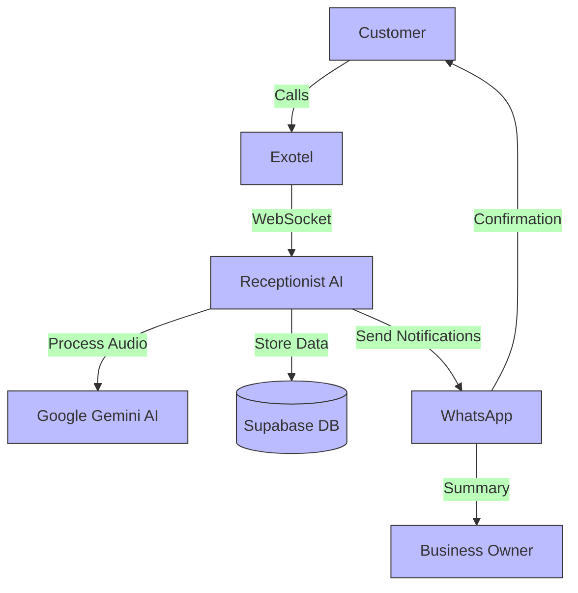
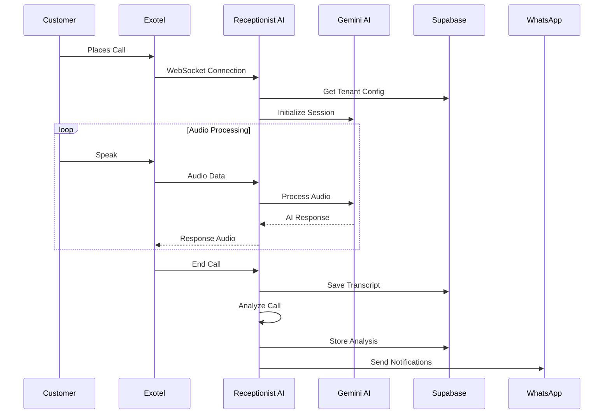
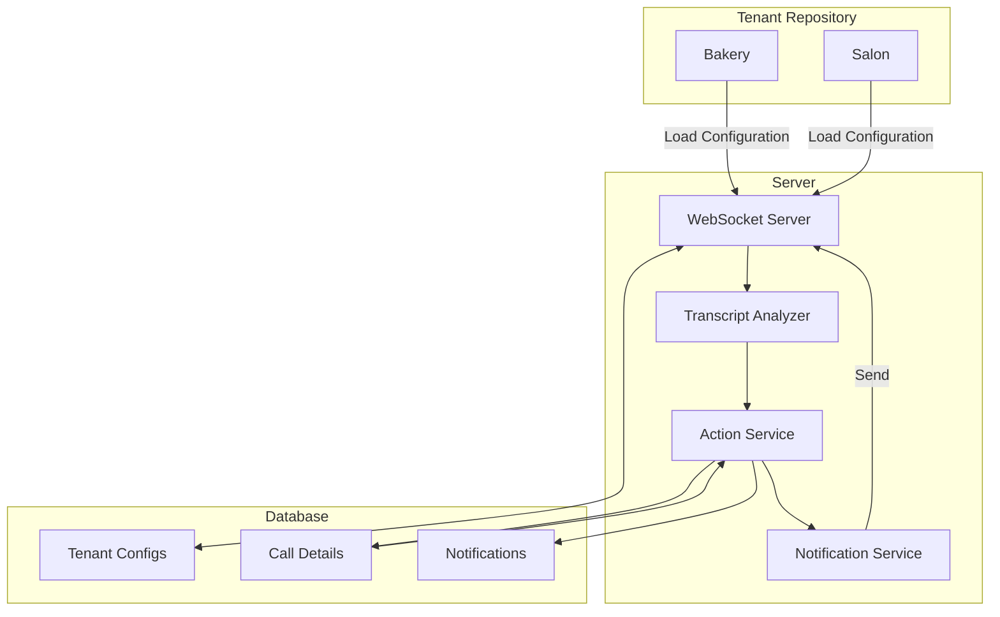
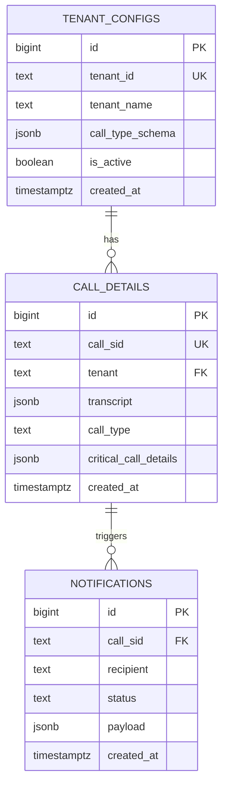
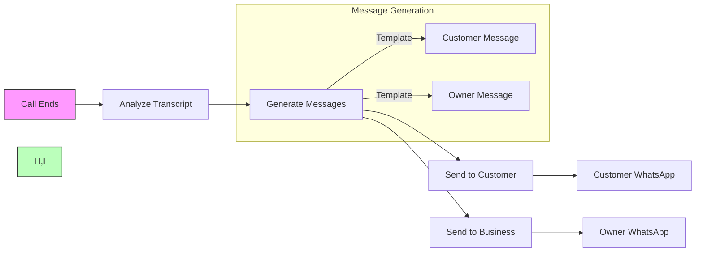

# Receptionist AI - Architecture Diagrams

This document contains Mermaid diagrams for the Receptionist AI system architecture.

## 1. System Overview

## 2. Call Flow Sequence

## 3. Multi-Tenant Architecture

## 4. Database Schema

## 5. Notification Flow

These diagrams provide a clear visualization of the system architecture and data flow. The Mermaid syntax has been simplified to ensure compatibility across different renderers.
