# Receptionist AI - Enterprise Architecture Diagrams

**Production-Ready Multi-Tenant Voice AI Platform**

This document contains comprehensive Mermaid diagrams showcasing the enterprise-grade architecture of Receptionist AI, designed for pitch presentations and technical documentation.

---

## 🏗️ 1. High-Level System Architecture

```mermaid
%%{init: {'theme': 'base', 'themeVariables': { 'primaryColor': '#1f77b4', 'primaryBorderColor': '#2c3e50', 'lineColor': '#34495e', 'primaryTextColor': '#2c3e50'}}}%%
flowchart TB
    subgraph "Customer Interface"
        Customer(["📞 Customer"])
    end
    
    subgraph "Telephony Layer"
        Exotel["☎️ Exotel Telephony<br/>Enterprise Grade"]
    end
    
    subgraph "AI Processing Core"
        Bridge["🌉 ExotelGeminiBridge<br/>WebSocket Server"]
        Session["🎯 GeminiSession<br/>Call Management"]
        Gemini["🧠 Google Gemini 2.5<br/>Live Audio AI"]
    end
    
    subgraph "Data & Analytics"
        Supabase[("🗄️ Supabase Database<br/>Real-time Analytics")]
        Transcript["📝 TranscriptManager<br/>Conversation Intelligence"]
        Analyzer["🔍 AI Analyzer<br/>Call Categorization"]
    end
    
    subgraph "Business Automation"
        Action["⚡ ActionService<br/>Post-call Automation"]
        WhatsApp["📱 MSG91/WhatsApp<br/>Smart Notifications"]
    end
    
    subgraph "Multi-Tenant Config"
        TenantRepo["📁 Tenant Repository<br/>Business-Specific Prompts"]
        TokenTracker["💰 AI Token Tracker<br/>Cost Optimization"]
    end
    
    Customer -.->|"Calls"| Exotel
    Exotel <-->|"Real-time Audio"| Bridge
    Bridge --> Session
    Session <-->|"Voice Processing"| Gemini
    Session --> Transcript
    Session --> TenantRepo
    Transcript --> Supabase
    Transcript --> Analyzer
    Analyzer --> Action
    Action --> WhatsApp
    Action --> Supabase
    Session --> TokenTracker
    TokenTracker --> Supabase
    WhatsApp -.->|"Notifications"| Customer
    WhatsApp -.->|"Business Alerts"| Business(["👔 Business Owner"])
    
    classDef customerClass fill:#e8f5e8,stroke:#27ae60,stroke-width:3px
    classDef aiClass fill:#e8f4fd,stroke:#3498db,stroke-width:3px
    classDef dataClass fill:#fef9e7,stroke:#f39c12,stroke-width:3px
    classDef automationClass fill:#f8e8e8,stroke:#e74c3c,stroke-width:3px
    
    class Customer,Business customerClass
    class Bridge,Session,Gemini,Analyzer aiClass
    class Supabase,Transcript,TenantRepo,TokenTracker dataClass
    class Action,WhatsApp automationClass
```



## 🔄 2. Real-Time Call Processing Flow

```mermaid
sequenceDiagram
    participant Customer as 📞 Customer
    participant Exotel as ☎️ Exotel
    participant Bridge as 🌉 ExotelGeminiBridge
    participant Session as 🎯 GeminiSession
    participant Gemini as 🧠 Gemini Live API
    participant DB as 🗄️ Supabase
    participant Analyzer as 🔍 AI Analyzer
    participant Action as ⚡ ActionService
    participant WhatsApp as 📱 WhatsApp
    
    Note over Customer,WhatsApp: Enterprise Voice AI Call Processing
    
    Customer->>+Exotel: Initiates call to business
    Exotel->>+Bridge: WebSocket connection (tenant info)
    Bridge->>+Session: Create session with tenant config
    
    Note over Session,DB: Dynamic Greeting System
    Session->>DB: Load tenant-specific prompt
    Session->>Session: extract_greeting_from_prompt()
    Session->>+Gemini: Initialize with custom greeting
    Gemini->>Session: AI greeting response
    Session->>Exotel: Stream greeting audio
    Exotel->>Customer: Play personalized greeting
    
    Note over Customer,Gemini: Real-time Conversation Loop
    loop Natural Voice Interaction
        Customer->>Exotel: Speaks (natural language)
        Exotel->>Session: Stream audio chunks
        Session->>Gemini: Process with Live API
        Gemini->>Session: Generate response (audio + transcript)
        Session->>Session: Buffer optimization
        Session->>Exotel: Stream AI response
        Exotel->>Customer: Play natural AI voice
        Session->>Session: Add to conversation transcript
    end
    
    Note over Customer,Action: Post-Call Intelligence & Automation
    Customer->>Exotel: Ends call
    Exotel->>Session: Connection closed
    Session->>DB: Save complete transcript
    Session->>+Analyzer: Trigger AI analysis
    Analyzer->>DB: Fetch tenant call schemas
    Analyzer->>Gemini: Structured data extraction
    Analyzer->>DB: Save categorized results
    Analyzer->>+Action: Trigger business actions
    
    Note over Action,WhatsApp: Smart Notification System
    Action->>DB: Fetch call details & tenant config
    Action->>WhatsApp: Send customer confirmation
    Action->>WhatsApp: Send business summary
    WhatsApp->>Customer: Personalized confirmation
    WhatsApp->>Business: Call analytics & insights
    
    Note over Customer,Business: Complete Customer Journey
```



## 🏢 3. Multi-Tenant Architecture & Deployment

```mermaid
%%{init: {'theme': 'base', 'themeVariables': { 'primaryColor': '#8e44ad', 'primaryBorderColor': '#2c3e50', 'lineColor': '#34495e'}}}%%
flowchart TB
    subgraph "Production Infrastructure"
        subgraph "Railway Cloud Platform"
            ProdServer["🚀 Production Server<br/>Branch: main<br/>Live Customer Calls"]
            PreprodServer["🧪 Pre-Production Server<br/>Branch: preprod<br/>Feature Testing"]
        end
        
        subgraph "Shared Database Layer"
            Database[("🗄️ Supabase Database<br/>Shared Across Environments")]
        end
    end
    
    subgraph "Multi-Tenant Configuration"
        subgraph "Tenant Repository Structure"
            Bakery["🧁 bakery/<br/>├── prompts/assistant.txt<br/>└── input_files/"]
            Dental["🦷 sreedevi_dental_rjy/<br/>├── prompts/assistant.txt (Telugu)<br/>└── input_files/"]
            Salon["💄 saloon/<br/>├── prompts/assistant.txt<br/>└── input_files/"]
            College["🎓 gsl_college/<br/>├── prompts/assistant.txt<br/>└── input_files/"]
            Others["... other tenants"]
        end
        
        subgraph "Database Tenant Config"
            TenantConfigs["📋 tenant_configs table<br/>• Business settings<br/>• Call type schemas<br/>• Owner contact info"]
        end
    end
    
    subgraph "External Integrations"
        Exotel["☎️ Exotel Telephony<br/>Enterprise Grade"]
        Gemini["🧠 Google Gemini API<br/>Live Audio Processing"]
        MSG91["📱 MSG91/WhatsApp<br/>Business Messaging"]
    end
    
    ProdServer --> Database
    PreprodServer --> Database
    ProdServer --> Bakery
    ProdServer --> Dental
    ProdServer --> Salon
    ProdServer --> College
    ProdServer --> Others
    Database --> TenantConfigs
    ProdServer <--> Exotel
    ProdServer <--> Gemini
    ProdServer <--> MSG91
    PreprodServer <--> Exotel
    PreprodServer <--> Gemini
    PreprodServer <--> MSG91
    
    classDef prodClass fill:#e8f5e8,stroke:#27ae60,stroke-width:3px
    classDef preprodClass fill:#fff2e8,stroke:#f39c12,stroke-width:3px
    classDef tenantClass fill:#e8f4fd,stroke:#3498db,stroke-width:2px
    classDef externalClass fill:#f8e8e8,stroke:#e74c3c,stroke-width:2px
    
    class ProdServer prodClass
    class PreprodServer preprodClass
    class Bakery,Dental,Salon,College,Others,TenantConfigs tenantClass
    class Exotel,Gemini,MSG91 externalClass
```



## 🔧 4. Component Architecture Deep Dive

```mermaid
%%{init: {'theme': 'base', 'themeVariables': { 'primaryColor': '#2980b9', 'primaryBorderColor': '#2c3e50', 'lineColor': '#34495e'}}}%%
classDiagram
    class ExotelGeminiBridge {
        +host: str
        +port: int
        +active_sessions: Dict
        +start_server()
        +handle_connection()
        +_parse_tenant_from_path()
    }
    
    class GeminiSession {
        +session_id: str
        +websocket: WebSocket
        +tenant: str
        +transcript_manager: TranscriptManager
        +gemini_session: GeminiLiveSession
        +run()
        +initialize()
        +send_dynamic_initial_greeting()
        +extract_greeting_from_prompt()
        +cleanup()
    }
    
    class TranscriptManager {
        +session_id: str
        +call_sid: str
        +tenant: str
        +transcript_data: dict
        +token_accumulator: CallTokenAccumulator
        +add_to_transcript()
        +save_transcript_and_analyze()
        +_merge_consecutive_messages()
    }
    
    class ActionService {
        +msg91_provider: MSG91Provider
        +whatsapp_service: WhatsAppNotificationService
        +owner_phone: str
        +process_call_actions()
        +_send_customer_notification()
        +_send_business_notification()
    }
    
    class CallTokenAccumulator {
        +call_sid: str
        +total_input_tokens: int
        +total_output_tokens: int
        +models_used: set
        +add_conversation_tokens()
        +save_to_database()
    }
    
    class WhatsAppNotificationService {
        +generate_notification_message()
        +send_notification()
        +_get_template_mapping()
    }
    
    ExotelGeminiBridge ||--o{ GeminiSession : manages
    GeminiSession ||--|| TranscriptManager : uses
    TranscriptManager ||--|| CallTokenAccumulator : tracks
    TranscriptManager --> ActionService : triggers
    ActionService ||--|| WhatsAppNotificationService : uses
    
    note for ExotelGeminiBridge "Main server orchestrating\nWebSocket connections"
    note for GeminiSession "Individual call management\nwith tenant-specific logic"
    note for TranscriptManager "Conversation intelligence\nand analysis pipeline"
    note for ActionService "Post-call automation\nand business workflows"
```

## 🚀 5. Deployment & CI/CD Pipeline

```mermaid
%%{init: {'theme': 'base', 'themeVariables': { 'primaryColor': '#16a085', 'primaryBorderColor': '#2c3e50', 'lineColor': '#34495e'}}}%%
flowchart LR
    subgraph "Development Workflow"
        Dev["👨‍💻 Developer<br/>Local Changes"]
        PreprodBranch["🌿 preprod branch<br/>Feature Testing"]
        MainBranch["🌿 main branch<br/>Production Ready"]
    end
    
    subgraph "Automated Deployment"
        PreprodDeploy["🧪 Preprod Railway<br/>Auto-deploy on push"]
        ProdDeploy["🚀 Production Railway<br/>Auto-deploy on merge"]
    end
    
    subgraph "Testing & Validation"
        PreprodTest["🔍 Integration Testing<br/>• WebSocket connections<br/>• Exotel simulation<br/>• AI analysis pipeline"]
        ProdMonitor["📊 Production Monitoring<br/>• Live call metrics<br/>• Error tracking<br/>• Performance analytics"]
    end
    
    subgraph "External Services"
        GitHub["📁 GitHub Repository<br/>Source Control"]
        Railway["☁️ Railway Platform<br/>Cloud Infrastructure"]
    end
    
    Dev --> PreprodBranch
    PreprodBranch --> GitHub
    GitHub --> PreprodDeploy
    PreprodDeploy --> PreprodTest
    PreprodTest --> MainBranch
    MainBranch --> GitHub
    GitHub --> ProdDeploy
    ProdDeploy --> ProdMonitor
    
    classDef devClass fill:#e8f5e8,stroke:#27ae60,stroke-width:2px
    classDef deployClass fill:#e8f4fd,stroke:#3498db,stroke-width:2px
    classDef testClass fill:#fff2e8,stroke:#f39c12,stroke-width:2px
    classDef externalClass fill:#f8e8e8,stroke:#e74c3c,stroke-width:2px
    
    class Dev,PreprodBranch,MainBranch devClass
    class PreprodDeploy,ProdDeploy deployClass
    class PreprodTest,ProdMonitor testClass
    class GitHub,Railway externalClass
```



---

## 📈 **Enterprise-Ready Architecture Highlights**

### 🎯 **Scalability Features**
- **Multi-tenant single-server architecture** supporting unlimited business types
- **Auto-scaling Railway infrastructure** handling concurrent calls
- **Optimized audio processing** with sub-100ms response times
- **Cost-efficient AI token management** with real-time tracking

### 🔒 **Production Reliability**
- **Two-server deployment strategy** (preprod + production)
- **Comprehensive error handling** and graceful degradation
- **Real-time monitoring** and analytics dashboard
- **Automated testing pipeline** ensuring code quality

### 🌐 **Integration Capabilities**
- **Enterprise telephony** via Exotel API
- **Multi-channel notifications** through WhatsApp Business
- **Real-time database** with Supabase for instant sync
- **Advanced AI processing** with Google Gemini Live API

### 💼 **Business Intelligence**
- **Automated call categorization** and sentiment analysis
- **Customer journey tracking** from call to conversion
- **Operational efficiency metrics** and cost optimization
- **Multi-language support** with cultural sensitivity

**Ready for enterprise deployment with proven scalability and reliability.**
    subgraph "Tenant Repository"
        B[Bakery]
        S[Salon]
    end
    
    subgraph "Server"
        W[WebSocket Server]
        T[Transcript Analyzer]
        A[Action Service]
        N[Notification Service]
    end
    
    subgraph "Database"
        TC[Tenant Configs]
        CD[Call Details]
        NO[Notifications]
    end
    
    B & S -->|Load Configuration| W
    W <--> TC
    W --> T --> A --> N
    N -->|Send| W
    CD --> A
    A --> CD & NO
```

## 4. Database Schema


## 5. Notification Flow


These diagrams provide a clear visualization of the system architecture and data flow. The Mermaid syntax has been simplified to ensure compatibility across different renderers.
