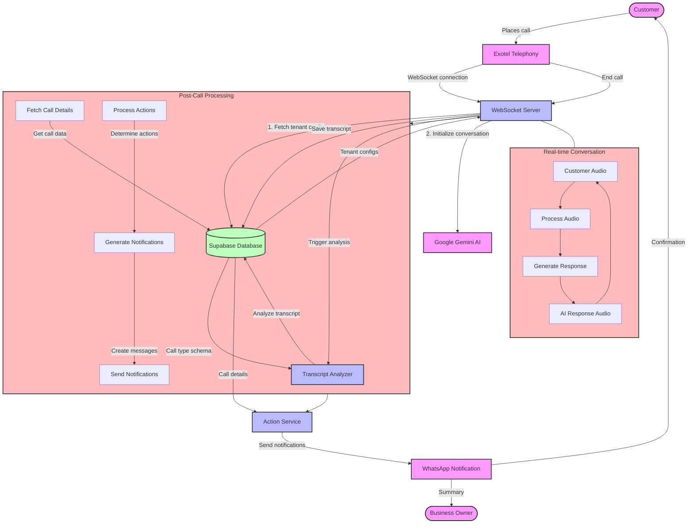
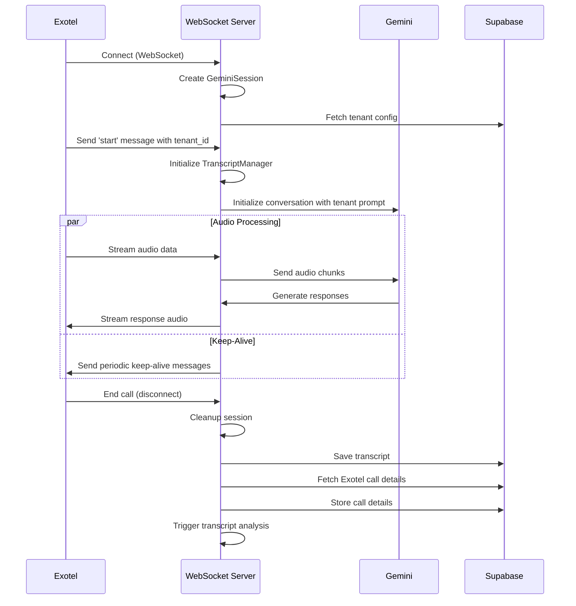
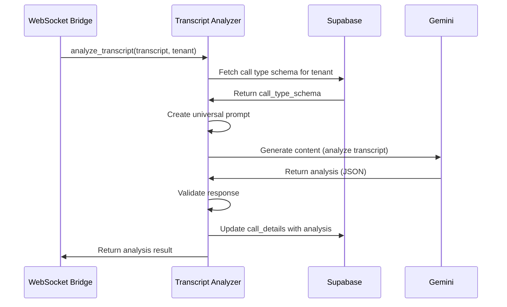
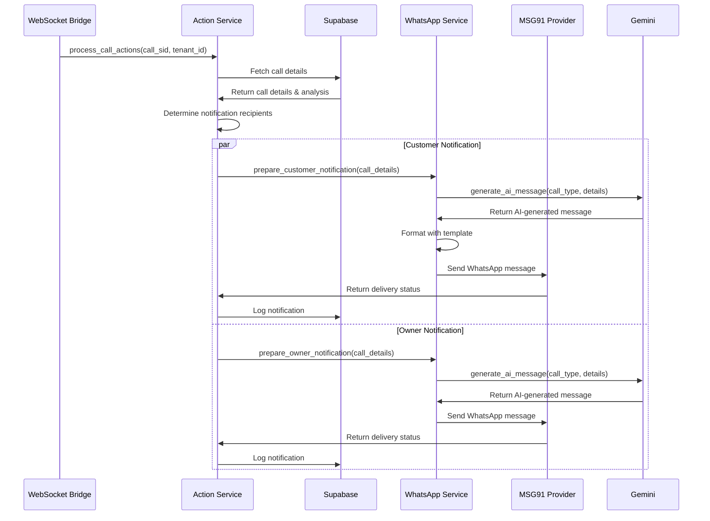
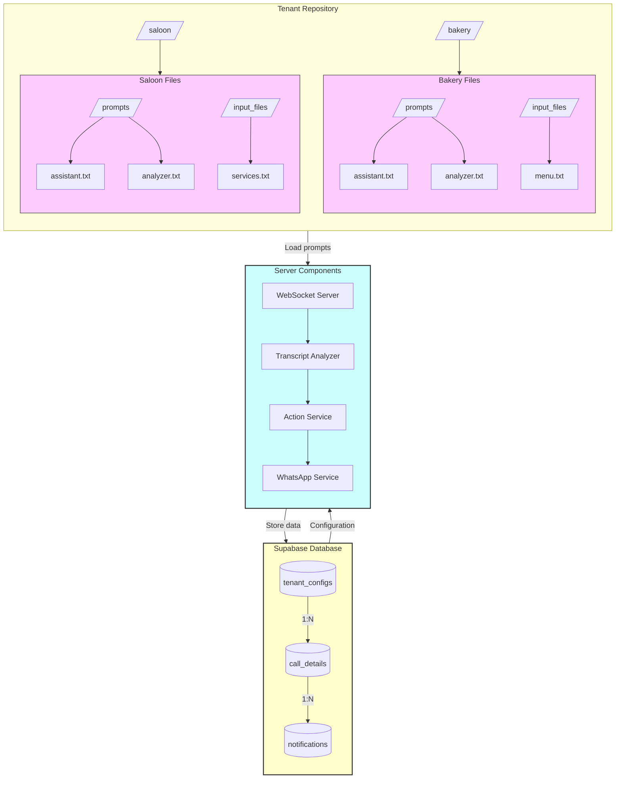
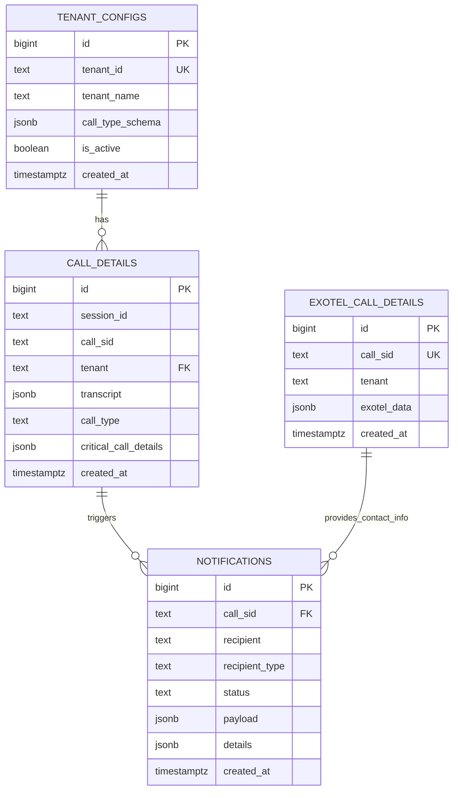

# Receptionist AI System Architecture

This document provides detailed flow diagrams for the Receptionist AI system architecture.

## Complete System Flow

## Component Interactions

### WebSocket Server Flow

### Transcript Analysis Flow

### Action Service Flow

## Multi-Tenant Architecture

## Database Schema

